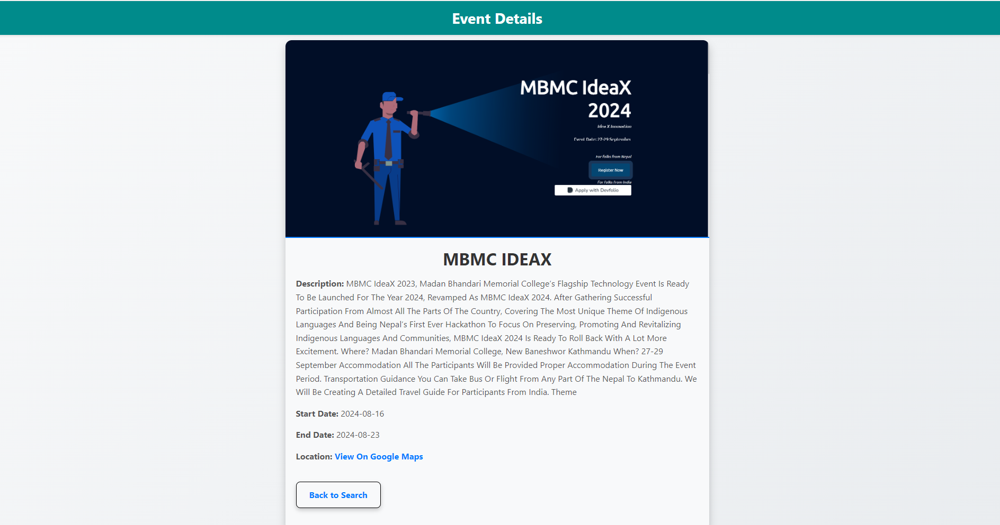

# Khoj-DB Setup Guide

## Introduction

This README provides instructions for setting up the `khoj-db` MySQL database and creating the required tables (`users` and `events`). Follow these steps to prepare your environment for running the associated PHP code.

## Prerequisites

- MySQL Server
- phpMyAdmin (or any MySQL client tool)
- Basic knowledge of SQL and phpMyAdmin

## Steps to Set Up the Database

### 1. Create the `khoj-db` Database

1. Log in to phpMyAdmin.
2. Click on the "Databases" tab.
3. In the "Create database" section, enter `khoj-db` as the database name.
4. Click "Create" to create the database.

### 2. Create the Tables

1. Select the `khoj-db` database from the left sidebar.
2. Click on the "SQL" tab to open the SQL query editor.
3. Copy and paste the following SQL query into the editor:

   ```sql
   CREATE TABLE `users` (
       `id` INT NOT NULL AUTO_INCREMENT PRIMARY KEY,
       `username` VARCHAR(50) NOT NULL UNIQUE,
       `password` VARCHAR(255) NOT NULL
   );
   CREATE TABLE `events` (
       `id` INT NOT NULL AUTO_INCREMENT PRIMARY KEY,
       `name` VARCHAR(255) NOT NULL,
       `description` TEXT NOT NULL,
       `start_date` DATE NOT NULL,
       `end_date` DATE NOT NULL,
       `google_map_url` VARCHAR(255),
       `image_path` VARCHAR(255),
       `user_id` INT NOT NULL,
       FOREIGN KEY (`user_id`) REFERENCES `users`(`id`)
    );

 
## Demo of the webapp 

